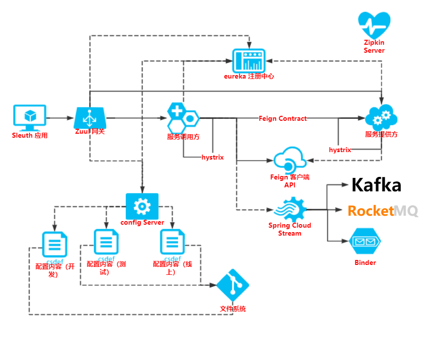

# Spring Cloud

## 架构图



## 版本

- spring boot: 1.5.7
- spring cloud : Dalston.SR4
- JDK : 1.8

### 分支说明

- 学习参考分支：[2018-08-07-study-spring-cloud](https://github.com/Darian1996/spring-cloud-2017)


## 项目目录

```cmake
├─assets
├─feign-person-api
├─feign-person-client
├─feign-person-service-provider
├─feign-ribbon-hystrix-person-api
├─feign-ribbon-hystrix-person-client
├─feign-ribbon-hystrix-person-service-provider
├─git-config-path
├─rest-client-api
├─rest-user-consumer
├─rest-user-service-provider
├─ribbon-client-api
├─ribbon-user-consumer
├─ribbon-user-service-provider-7070
├─ribbon-user-service-provider-7071
├─ribbon-user-service-provider-7072
├─spring-cloud-config-client
├─spring-cloud-config-server-demo
├─spring-cloud-eureka-server-double-9090
├─spring-cloud-eureka-server-double-9091
├─spring-cloud-eureka-server-single-9090
├─spring-cloud-hystrix-client-demo
├─spring-cloud-hystrix-dashboard-demo
├─spring-cloud-sleuth-config-server-demo
├─spring-cloud-sleuth-person-api
├─spring-cloud-sleuth-person-client
├─spring-cloud-sleuth-person-service-provider
├─spring-cloud-sleuth-sleuth-demo
├─spring-cloud-sleuth-zipkin-server-demo
├─spring-cloud-sleuth-zuul-demo
├─spring-cloud-stream-kafka
├─spring-cloud-stream-kafka-stream-api
├─spring-cloud-stream-rabbitmq-stream-api
├─spring-cloud-zuul-config-server-demo
├─spring-cloud-zuul-person-api
├─spring-cloud-zuul-person-client
├─spring-cloud-zuul-person-service-provider
├─spring-cloud-zuul-proxy-demo
```


## 项目端口

| 项目                                         | 端口  |
| -------------------------------------------- | ----- |
| config-client                                | 10001 |
| config-server                                | 10000 |
| rest-user-provider                           | 7070  |
| rest-user-consumer                           | 8080  |
| eureka-demo                                  | 9090  |
| eureka-demo-9090                             | 9090  |
| eureka-demo-9091                             | 9091  |
| ribbon-user-consumer                         | 8080  |
| ribbon-user-provider-7070                    | 7070  |
| ribbon-user-provider-7071                    | 7071  |
| ribbon-user-provider-7072                    | 7072  |
| hystrix--client-demo                         | 11001 |
| hystrix-dashboard-demo                       | 11002 |
| feign-person-client                          | 8080  |
| feign-person-provider                        | 7070  |
| feign-ribbon-hystrix-person-client           | 8080  |
| feign-ribbon-hystrix-person-service-provider | 7070  |
| spring-cloud-config-server-demo              | 9999  |
| spring-cloud-zuul-proxy                      | 12001 |
|                                              |       |
| Zipkin-server                                | 23456 |
|                                              |       |
|                                              |       |
|                                              |       |


## Test

> 为了方便测试 `添加用户` -> get 请求，自己使用时请改成 POST

### Config


### eureka

- eureka.url = 
  - http://localhost:9090/ 
  - http://localhost:9091/ 

- RestAPI Test
  - consumer: 
    - http://localhost:8080/user/save?id=4&name=sdf 
    - http://localhost:8080/user/list
  - provider: 为方便测试，全部 Get 请求
    - http://localhost:7070/user/save?id=1&name=dddd
    - http://localhost:7070/user/list


### Ribbon

- eureka.url = 
  - http://localhost:9090/ 
  - http://localhost:9091/ 

- consumer:

  - http://localhost:8080/user/save?id=4&name=sdf 

  - http://localhost:8080/user/list

    ```cmd
    [Server:localhost:7071;	Zone:defaultZone;, 
    [Server:localhost:7072;	Zone:defaultZone;, 
    [Server:localhost:7070;	Zone:defaultZone;,
    ```

- provider:

  - http://localhost:7070/user/save?id=1&name=dddd
  - http://localhost:7070/user/list
  - http://localhost:7071/user/save?id=1&name=dddd
  - http://localhost:7071/user/list
  - http://localhost:7072/user/save?id=1&name=dddd
  - http://localhost:7072/user/list


### Hystrix

- hystrix
  - http://localhost:11001/mappings
  - http://localhost:11001/hello-world
  - http://localhost:11001/hello-world-2

- Hystrix Dashboard

  - > 输入 http://localhost:11001/hystrix.stream

  - http://localhost:11002/hystrix

### feign

- feign-client
  - http://localhost:8080/person/find/all
  - http://localhost:8080/person/save?id=3&name=sfd
- feign-provider
  - http://localhost:7070/person/save?id=3&name=sfd
  - http://localhost:7070/person/find/all

### feign-ribbon-hystrix

- client
  - http://localhost:8080/person/find/all
  - http://localhost:8080/person/save?id=3&name=sfd
- provider
  - http://localhost:7070/person/find/all
  - http://localhost:7070/person/save?id=3&name=sfd

> 坑：
>
> ```java
> @GetMapping("person/save")
> boolean save(@RequestParam("id") Long id, @RequestParam("name") String name);
> 
> ```
>
> feign 的自动提升为 POST 请求，需要注意


### zuul+feign-ribbon-hystrix

- zuul:​	
  - http://localhost:12001/spring-cloud-config-server/mappings
  - http://localhost:12001/person-service/mappings
  - http://localhost:12001/person-client/mappings
  - 网关代理测试
    - http://localhost:12001/person-client/person/find/all
    - http://localhost:12001/person-client/person/save?id=3&name=sfd
    - http://localhost:12001/person-service/person/find/all
    - http://localhost:12001/person-client/person/save?id=3&name=sfd


### stream


### sleuth-stream-spring-cloud


### zipkin 

#### 启动顺序

- eureka

- config-server  需要把 config 注册到 eureka 上

- zuul
- zipkin-server
- sleuth-sleuth-demo

---


- http://localhost:23456/zipkin/ 


- 调用链路测试
  - http://localhost:12001/person-client/person/find/all
    - 查看zipkin
      - 


- seluth
  - http://localhost:6060/to/zuul/person-client/person/find/all
  - http://localhost:6060


## 注意

### 环境配置

```properties
# 配置 Spring Kafka 配置信息
spring.kafka.bootstrap-servers=kafka.darian.com:9092
# 配置 kafka 的 zookeeper 的节点
spring.cloud.stream.kafka.binder.zk-nodes=zookeeper.darian.com:2181
```


`‪C:\Windows\System32\drivers\etc\HOSTS` 文件

```java
192.168.40.128 kafka.darian.com
192.168.40.128 zookeeper.darian.com
```


```cmake
2019-08-18 05:57:14.318  INFO [person-service,,,] 17404 --- [           main] o.s.c.s.b.k.p.KafkaTopicProvisioner      : Using kafka topic for outbound: sleuth
```

